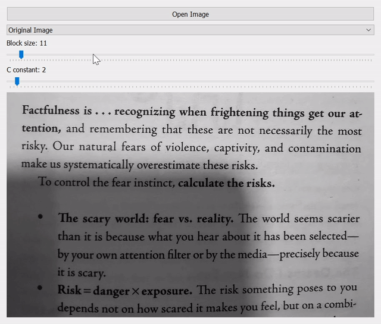

# OpenCV-with-Python-Series

Code repository for my tutorial series which covers beginner to advanced topics on OpenCV with Python. 😁

I'm using Windows and Python 3.8. However, the code should be cross-platform and run without any problem on GNU/Linux and Mac OS.

## Running the Examples

To run the examples yourself open a terminal and checkout the repo:

    $ git clone https://github.com/joschuck/OpenCV-with-Python-Series

Next, install the required Python modules:

    $ cd OpenCV-with-Python-Series
    $ python -m pip install -r requirements.txt

Once you have installed the modules run any example like this:

    $ python -m src.run

### 01 Thresholding

This tutorial explains image thresholding (simple thresholding, adaptive thresholding and Otsu's method) by example through enhancement of document pictures.

## That's For Now

Thanks for reading! 😊
